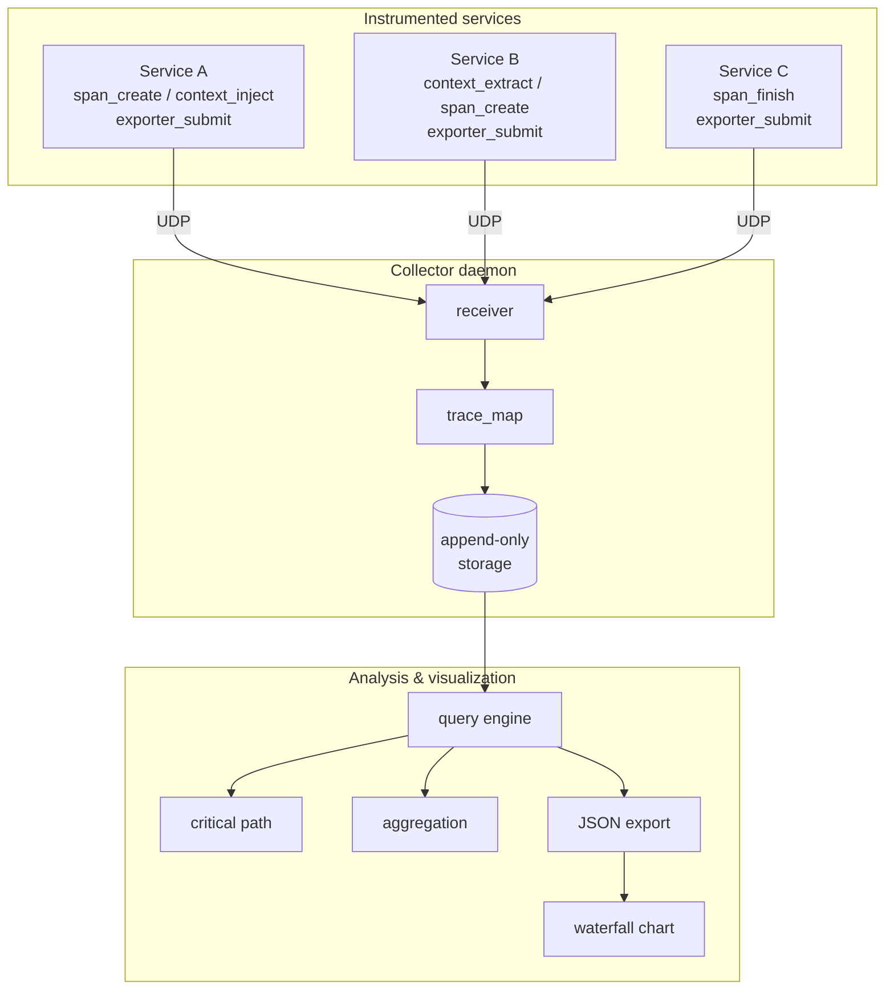
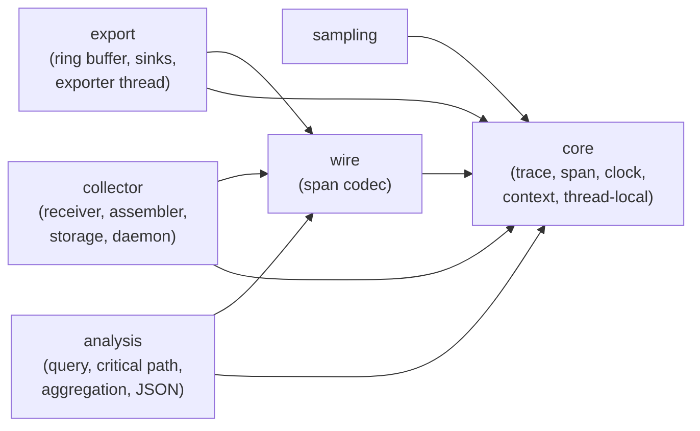

# Dapper-Lite

A from-scratch distributed tracing system in C, implementing all core
features from Google's Dapper paper (Sigelman et al., 2010).

Built with minimal dependencies (C11, pthreads, POSIX sockets) to
demonstrate distributed systems observability, production constraints,
and performance-first engineering.

---

## Architecture

Instrumented services create spans, propagate trace context across
process boundaries, and export finished spans out-of-band to a central
collector. The collector reassembles spans into traces and persists
them; the analysis layer reconstructs and queries them.



The library is split into decoupled layers. A neutral **wire** module
owns the span codec so the exporter, collector, and analysis layers all
share one definition of the on-the-wire format without depending on each
other:



### Key Design Principles

1. Low overhead -- async export, lock-free ring buffer.
2. Head-based sampling -- decision made once per trace and propagated
   (carried on every span and through the context wire format).
3. Decoupled architecture -- services, collectors, and storage are
   independent; the wire codec lives in its own neutral module.
4. Safe by default -- the collector binds loopback, caps resource use,
   and distinguishes log corruption from end-of-file.
5. From scratch -- minimal external dependencies, maximum learning value.

---

## Features

All 8 implementation phases are complete:

| Phase | Feature | Description |
|-------|---------|-------------|
| 1 | Traces and Spans | Core data model with unique IDs, hierarchy, monotonic timing, annotations |
| 2 | Context Propagation | Thread-local span, cross-process 17-byte wire format, wall-clock timestamps |
| 3 | Sampling | Probabilistic and adaptive head-based sampling with statistics |
| 4 | Async Export | Lock-free SPSC ring buffer, background exporter thread, UDP and file sinks |
| 5 | Central Collector | UDP receiver, trace map assembler, append-only storage, flush daemon |
| 6 | Trace Reconstruction | Query engine, critical path analysis, latency aggregation, JSON export |
| 7 | Visualization | Python waterfall chart generator, latency analysis scripts, full-system demo |
| 8 | Performance Evaluation | 8 benchmarks, overhead analysis, shared harness |

---

## Quick Start

### Prerequisites

- GCC or Clang (C11 support)
- Make
- Python 3.8+ (for visualization scripts)

### Build

```bash
make all            # Build everything (examples, tests, collector)
make benchmarks     # Build all benchmarks
```

### Run Tests

```bash
make run-tests      # 93 unit tests across 6 phases
```

### Run Examples

```bash
make run-examples   # Single span, parent-child, cross-process, sampling
```

### Run Full System Demo

```bash
make run-full-system   # Collector + 3 services + trace export + visualization
```

### Run Benchmarks

```bash
make run-benchmarks    # All 8 benchmarks including overhead analysis
```

### Coverage

```bash
make coverage          # gcov line/branch coverage per source file
```

---

## Project Structure

```
dapper-lite/
|-- include/dapper/          Public headers (opaque handles, stable API)
|   |-- types.h              Core data structures (trace_t, span_t)
|   |-- trace.h              Trace lifecycle API
|   |-- span.h               Span lifecycle and annotation API
|   |-- context.h            Context propagation (serialize/deserialize)
|   |-- sampler.h            Probabilistic and adaptive sampling
|   |-- wire.h               Neutral span wire-format codec
|   |-- byteorder.h          Shared host<->big-endian helpers
|   |-- exporter.h           Ring buffer, exporter thread
|   |-- collector.h          Collector daemon, config, stats
|   |-- analysis.h           Query engine, critical path, aggregation
|-- src/
|   |-- core/            trace.c, span.c, clock.c (+clock.h), thread_local.c, context.c
|   |-- sampling/        sampler.c
|   |-- wire/            serialize.c  (span encode/decode)
|   |-- export/          ring_buffer.c, file_sink.c, udp_sink.c, exporter_thread.c
|   |                    (+ private export_internal.h: ring buffer + sink internals)
|   |-- collector/       protocol.c, receiver.c, assembler.c, storage.c, main.c
|   |                    (+ private internal.h: trace map / partial trace internals)
|   |-- analysis/        query.c, critical_path.c, aggregation.c, export_json.c
|   |                    (+ span_walk.h: shared preorder span traversal)
|-- examples/
|   |-- 01-single-span/     Simplest possible trace
|   |-- 02-parent-child/    Demonstrates hierarchy
|   |-- 03-cross-process/   Cross-process context propagation via TCP
|   |-- 04-sampling/        Probabilistic and adaptive sampling demo
|   |-- 05-full-system/     3-service demo with collector, export, and visualization
|-- tests/unit/
|   |-- minunit.h           Minimal test framework
|   |-- test_phase1.c       12 tests: traces, spans, hierarchy, annotations
|   |-- test_phase2.c       10 tests: thread-local, context, sampling propagation, wall-clock
|   |-- test_phase3.c        9 tests: probabilistic, adaptive, override sampling
|   |-- test_phase4.c       13 tests: serialization, ring buffer, sinks, exporter
|   |-- test_phase5.c       22 tests: protocol, receiver, assembler, storage, caps, auth
|   |-- test_phase6.c       27 tests: query, critical path, aggregation, JSON, corruption, e2e
|-- benchmarks/
|   |-- common.h                Shared benchmark harness
|   |-- sampling_decision.c     Sampling decision latency (10M iterations)
|   |-- trace_creation.c        Trace creation with sampling (1M iterations)
|   |-- span_creation.c         Span create+finish latency (1M iterations)
|   |-- context_inject.c        Context injection latency (10M iterations)
|   |-- ring_buffer_throughput.c SPSC ring buffer throughput (1M spans)
|   |-- export_throughput.c     Export submit hot-path latency (1M iterations)
|   |-- collector_ingest.c      Collector UDP ingestion rate (50k spans)
|   |-- overhead_analysis.c     End-to-end CPU overhead analysis
|-- scripts/
|   |-- visualize_trace.py      Waterfall chart generator
|   |-- analyze_latency.py      Latency distribution analysis
|   |-- coverage.sh             gcov coverage runner
|-- docs/
|   |-- quality-targets.md      Coverage baseline, CRAP and mutation targets
|-- Makefile
```

---

## API Reference

### Trace Management

```c
trace_t* trace_create(void);
trace_t* trace_create_with_id(trace_id_t trace_id);
trace_t* trace_create_sampled(sampler_t* sampler, const char* endpoint);
void trace_destroy(trace_t* trace);
```

### Span Lifecycle

```c
span_t* span_create(trace_t* trace, span_t* parent, const char* name);
void span_annotate(span_t* span, const char* key, const char* value);
void span_finish(span_t* span);
uint64_t span_duration_ns(const span_t* span);
```

### Thread-Local Context

```c
void span_set_current(span_t* span);
span_t* span_get_current(void);
```

### Context Propagation

```c
int context_inject(const span_t* span, uint8_t* buffer, size_t bufsize);
int context_extract(trace_context_t* ctx, const uint8_t* buffer, size_t bufsize);
span_t* span_create_from_context(trace_t* trace, const trace_context_t* ctx,
                                 const char* name);
```

The injected context carries the trace ID, parent span ID, and the
head-based sampling decision, so a downstream service inherits the same
decision made at the trace root.

### Sampling

```c
sampler_t* sampler_create_probability(double rate);          // fixed rate 0.0 - 1.0
sampler_t* sampler_create_adaptive(int target_tps);          // target traces/sec
sampler_t* sampler_create_override(sampler_t* base,          // per-endpoint override
                                   const char* endpoint, double rate);
int sampler_should_sample(sampler_t* s, const char* endpoint,
                          sampling_decision_t* decision);
int sampler_get_stats(sampler_t* s, sampler_stats_t* stats);
void sampler_destroy(sampler_t* s);
```

### Async Export

```c
exporter_t* exporter_create_file(const char* path);
exporter_t* exporter_create_udp(const char* host, int port);
int exporter_start(exporter_t* exp);
void exporter_submit(exporter_t* exp, const span_t* span);   // non-blocking hot path
void exporter_stop(exporter_t* exp);
void exporter_get_stats(const exporter_t* exp, exporter_stats_t* stats);
void exporter_destroy(exporter_t* exp);
```

`exporter_submit()` encodes each span's real sampling decision; the
caller gates submission on whether the trace was sampled.

### Collector

```c
collector_config_t collector_default_config(void);
collector_t* collector_create(const collector_config_t* config);
int collector_start(collector_t* c);
int collector_port(const collector_t* c);                    // resolves port 0 (ephemeral)
void collector_get_stats(const collector_t* c, collector_stats_t* stats);
void collector_stop(collector_t* c);
void collector_destroy(collector_t* c);
```

#### Collector configuration and safe defaults

`collector_default_config()` returns settings that are safe for local
development. `collector_config_t` exposes:

| Field | Default | Purpose |
|-------|---------|---------|
| `bind_addr` | `127.0.0.1` | Bind address; non-loopback is opt-in |
| `port` | 7831 | UDP port (`0` = OS-assigned ephemeral) |
| `allowed_sources` | none | Comma-separated IPv4 allowlist |
| `auth_fn` | none | Optional per-datagram authentication hook |
| `max_active_traces` | 65536 | Cap on concurrent partial traces |
| `max_spans_per_trace` | 4096 | Cap on spans accumulated per trace |
| `max_packets_per_sec` | 0 (off) | Optional ingress rate limit |

Datagrams from disallowed sources or rejected by the auth hook, and
spans dropped by the resource caps, are counted in `collector_stats_t`
(`packets_unauthorized`, `packets_rate_limited`, `traces_dropped`,
`spans_dropped`). The daemon accepts matching CLI flags:

```bash
build/bin/collector -b 127.0.0.1 -p 7831 -s traces.log \
                    -a 10.0.0.5,10.0.0.6 -r 50000 -t 5
```

---

## Performance

Benchmark results (Apple Silicon, -O2):

| Benchmark | Metric | Result | Target |
|-----------|--------|--------|--------|
| Sampling decision | p50 latency | <1ns (sub-clock) | <200ns |
| Context injection | p50 latency | <1ns (sub-clock) | <50ns |
| Export submit | p50 latency | <1ns (sub-clock) | <500ns |
| Ring buffer | throughput | ~9M spans/sec | >1M spans/sec |
| Collector ingestion | throughput | ~136k spans/sec | >100k spans/sec |
| Span creation | mean latency | ~1.1us | (informational) |

### Overhead Analysis

For a service handling 10k requests/sec with 5 spans/request at 1% sampling:

| Component | Mean (ns) | Calls/sec | CPU (ms/sec) |
|-----------|-----------|-----------|-------------|
| Span create+finish | ~1170 | 50,000 | ~58.5 |
| Sampling decision | ~130 | 10,000 | ~1.3 |
| Context injection | ~27 | 10,000 | ~0.3 |
| Export submit | ~45 | 500 | ~0.02 |

Span creation dominates due to per-span `malloc()`. A production system
would use arena/pool allocation to reduce this to <100ns, bringing total
overhead well below 1% CPU.

---

## Wire Format

### Span Wire Format (48-byte header + variable payload, 256 bytes max)

```
Offset  Size  Field
------  ----  -----
0       8     trace_id (big-endian)
8       8     span_id
16      8     parent_span_id
24      8     start_ts (microseconds since epoch)
32      8     duration_us
40      1     sampled
41      1     flags
42      2     name_len
44      2     num_annotations
46      2     reserved
48      N     span name (UTF-8)
48+N    ...   annotations (key_len + key + value_len + value)
```

### Context Wire Format (17 bytes)

```
Offset  Size  Field
------  ----  -----
0       8     trace_id (big-endian)
8       8     span_id (big-endian)
16      1     flags (bit 0 = sampled)
```

The sampled bit propagates the head-based sampling decision across
process boundaries, so a downstream service honours the same decision
made at the trace root.

### Storage Format (append-only log)

Each completed trace is written as one self-contained record:

```
[8 bytes]  trace_id (big-endian)
[4 bytes]  num_spans (big-endian)
For each span:
  [4 bytes]  span_wire_len (big-endian)
  [N bytes]  serialized span (span wire format above)
```

Records are staged in memory and written with a single append, so the
declared span count always matches the bytes that follow. The reader
distinguishes a clean end-of-file from a corrupt or truncated tail.

---

## Comparison with Dapper Paper

| Dapper Feature | Dapper-Lite | Notes |
|----------------|-------------|-------|
| Trace/span model | Complete | 64-bit IDs, annotations |
| Context propagation | Complete | Explicit RPC headers, 17-byte wire format |
| Head-based sampling | Complete | Probabilistic + adaptive, propagated end to end |
| Async out-of-band reporting | Complete | Lock-free SPSC ring buffer |
| Centralized collection | Complete | UDP receiver, trace map assembly |
| Trace reconstruction | Complete | Out-of-order span handling |
| Latency analysis | Complete | Critical path, aggregation |
| Visualization | Complete | Waterfall timeline charts |

### Simplifications vs. Production Dapper

| Aspect | Dapper (Production) | Dapper-Lite |
|--------|---------------------|-------------|
| Trace ID size | 128-bit | 64-bit |
| RPC integration | Automated | Manual headers |
| Sampling | Multi-tier | Single-tier |
| Storage | Bigtable | Append-only log |
| Span allocation | Arena/pool | malloc per span |

---

## Building

```bash
# Install dependencies (Ubuntu/Debian)
sudo apt-get install build-essential

# Build
make all

# Verify
make run-tests       # 93 unit tests
make run-benchmarks  # 8 benchmarks
make run-examples    # All examples
```

### Make Targets

| Target | Description |
|--------|-------------|
| `all` | Build everything (examples, tests, collector) |
| `benchmarks` | Build all benchmarks |
| `run-tests` | Run all 93 unit tests |
| `run-benchmarks` | Run all 8 benchmarks |
| `run-examples` | Run all examples |
| `run-full-system` | Run full 3-service demo with collector |
| `run-visualization` | Generate waterfall charts from trace JSON |
| `coverage` | gcov line/branch coverage + CRAP/mutation targets |
| `format` | Format source with clang-format |
| `valgrind` | Run valgrind memory checks |
| `clean` | Remove build directory |
